<div align="center">

# Esteban Javier Berumen Nieto

### Cloud Data Engineer · Databricks · Spark · AWS · Azure

I build reliable data pipelines and platforms with an emphasis on automation,
distributed processing, and performance.

[](https://www.linkedin.com/in/estebanberumen1703)
[](https://github.com/XTEP63)
[](mailto:estebanjbn@gmail.com)

</div>

<picture>
  <source media="(prefers-color-scheme: dark)" srcset="./assets/data-platform-flow.svg">
  <source media="(prefers-color-scheme: light)" srcset="./assets/data-platform-flow.svg">
  
</picture>

## What I build

- **Cloud data pipelines** that move from ingestion to trusted, analytics-ready datasets.
- **Distributed processing workflows** with Spark and Databricks, designed for scale and maintainability.
- **Data platform layers** using Delta Lake, Parquet, SQL, and medallion-style architecture.
- **Automation and performance improvements** that make recurring data workloads faster and easier to operate.

```text
ingest  →  validate  →  transform  →  model  →  serve  →  observe
```

## Core toolbox

| Focus | Technologies |
| --- | --- |
| Engineering | Python · SQL · Apache Spark · Databricks |
| Cloud & storage | AWS · Azure · Delta Lake · Apache Parquet |
| Platform & delivery | Git · Docker · GitHub Actions · PostgreSQL |

<p>
  
  
  
  
  
  
  
  
</p>

## Selected work

| Project | What it demonstrates | Stack |
| --- | --- | --- |
| [**GBM Portfolio USA Tracker**](https://github.com/XTEP63/gbm_portfolio_tool) | A local data product that turns daily Excel snapshots into landing, bronze, silver, and gold layers; publishes Parquet/CSV facts and an HTML report. | Python · Pandas · Parquet · Jinja · YAML |
| [**IMEDIA Project v2**](https://github.com/XTEP63/IMEDIA_Project_v2) | A reproducible Reddit ingestion and processing pipeline with raw, bronze, and silver layers, analytical storage, an API, and an interactive UI. | Python · Polars · Parquet · SQLite · FastAPI · Streamlit · Docker |
| [**Jalisco Connection Points**](https://github.com/XTEP63/Streamlit_Conection_Points_Jalisco) | An interactive app that explores public connectivity data and evaluates a KNN model for bandwidth classification. | Python · Streamlit · scikit-learn · Pandas |
| [**Wastewater SARS-CoV-2**](https://github.com/XTEP63/Wastewater-SARS-CoV-2) | A time-series study built from CDC wastewater data, including preprocessing, baselines, forecasting, and geographic propagation analysis. | Python · Jupyter · LSTM · Transformers · CDC API |

> Public repositories show selected personal and academic work. My professional focus is cloud data engineering across Databricks, Spark, AWS, and Azure.

## Engineering activity

<div align="center">
  
</div>

<details>
<summary><strong>Contribution stream</strong></summary>
<br>
<picture>
  <source media="(prefers-color-scheme: dark)" srcset="https://raw.githubusercontent.com/XTEP63/XTEP63/output/github-contribution-grid-snake-dark.svg">
  <source media="(prefers-color-scheme: light)" srcset="https://raw.githubusercontent.com/XTEP63/XTEP63/output/github-contribution-grid-snake.svg">
  
</picture>
</details>

---

<div align="center">
  <sub>Building dependable paths from raw data to useful decisions.</sub>
</div>
